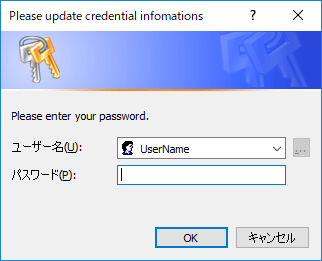

# Set-AuthProxy

Proxy Authentication set credential info on PowerShell

## Usage

## 1. start powershell as administrator and do below command

~~~ PowerShell
>Set-ExecutionPolicy -ExecutionPolicy RemoteSigned
~~~

## 2. install Set-AuthProxy.psm1

please check your module dir by below command

~~~ PowerShell
>$env:PSModulePath
~~~

and make Set-PSAuthProxy dir and save Set-AuthProxy.psm1

Example
>$env:PSModulePath\Set-PSAuthProxy\Set-AuthProxy.psm1

## 3. make a PowerShell_profile.ps1 and add Set-AuthProxy function

open or make PowerShell_profile.ps1 by below command

~~~ PowerShell
>notepad $profile
~~~

and write content below

~~~ PowerShell
>import-module Set-AuthProxy
>Set-AuthProxy "Set"
~~~

and save and close PowerShell_profile.ps1

## 4. edit your personal info to Set-PSAuthProxy.psm1

Please edit proxy host name, proxy port no, password and aes key file path.

~~~ PowerShell
# set your own environments
$ProxyHostName = "ProxyHostName"
$ProxyPortNo = "8080"

# set direction to save_password and aes key
# this setting is example. please set diffrent dirs!
$password_file_path = $env:USERPROFILE + "\ps.credential"
$aes_key_file_path = $env:USERPROFILE + "\ps.aes"

# whitch you get username by environ or not
# if UserName value is blank, use environ username
$UserName = "UserName"
~~~

option: You can set username, if your user name is same as login name.
please blank like this below.

~~~ PowerShell
$UserName = ""
~~~

## 5. restart powershell and activate Set-PSAuthProxy automatically

First time start Set-PSAuthProxy, you don't have password and aes key files.

You saw dialog below. please enter your password, and enter.
Create encrypt password file and aes key files.

----

## Tips

### When you want to change password

please type command below

~~~ PowerShell
> Set-AuthProxy Set Change
~~~

maybe shows up above dialogs.please type new passwords

### When you want to clear auth proxy settings at this settion

please type command below

~~~ PowerShell
> Set-AuthProxy Clear
~~~

all clear auth proxy settings. but you wants to reset auth proxy.

please type command below

~~~ PowerShell
> Set-AuthProxy Set
~~~